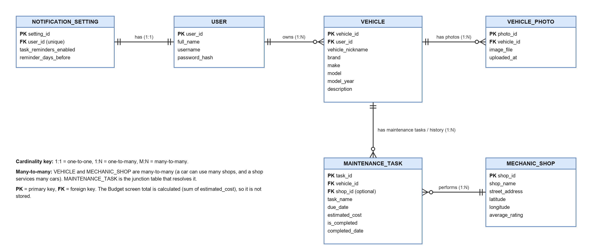

# AutoPal

**Live app:** https://autopal-one.vercel.app

## App Summary

Many drivers, especially students and first-time car owners, don't know what maintenance their car needs or when it's due. They usually find out only when something breaks and the repair costs far more than the routine service would have. Keeping track by memory, receipts in a glovebox, or a dashboard light they don't understand doesn't work, and it's hard to know what a repair should cost or which nearby shop to trust. AutoPal is a mobile-friendly web app that keeps all of this in one place. Users add their vehicles to a garage, and AutoPal automatically sets up a standard maintenance schedule (oil changes, tire rotations, inspections) that they can add their own tasks to. Upcoming tasks show on the home screen, overdue ones turn red, and checking a task off moves it to the car's history with an optional receipt photo. A budget screen totals the estimated cost of upcoming and past repairs, a map shows nearby mechanic shops with ratings and average repair prices, and a library explains basic DIY jobs and what each dashboard warning light means.

## ERD



The diagram is our Step 1 design. While building, we kept the same core structure and added a few supporting tables and columns:
- `USER` became `profiles`, linked to Supabase Auth, which stores and hashes passwords so we don't keep a `password_hash` column.
- `maintenance_catalog` holds the standard tasks every new car gets.
- `guides` holds the Library content.
- `receipt_path` on tasks, `avatar_path` and `distance_unit` on profiles, and `average_repair_price` / `services` on shops support the final screens.

## Tech Stack

| Layer | What we used | Why it fits our team |
|---|---|---|
| Front end | Plain HTML, CSS and JavaScript (ES modules), no framework and no build step | Everyone on the team already knows HTML/CSS/JS. There's no toolchain to install or break: edit a file, refresh, and see the change. |
| Installable app | Progressive Web App (manifest + service worker) | Users can "Add to Home Screen" and use it like a phone app, without app-store accounts or a separate mobile codebase. |
| Database | Supabase Postgres | A real relational database that matches our ERD. Row Level Security rules in the database make sure each user can only see their own cars and tasks. |
| Authentication | Supabase Auth + a small Edge Function for username sign-in | Secure password handling and sessions out of the box. The Edge Function lets people log in with a username, as our design called for. |
| File storage | Supabase Storage (private buckets) | Vehicle photos, receipts and profile pictures are stored privately per user. |
| Map | Leaflet + OpenStreetMap | A free, Google-Maps-style map with no API key or billing account. |
| Hosting | Vercel (static site, connected to GitHub) | Every push to `main` deploys automatically in under a minute. Free tier. |

Supabase and Vercel both have free tiers, and together they cover everything a "backend" would normally need. That lets a small student team spend its time on the app instead of on servers.

## How to Get It Running

### Option A: Use the live app (no setup)

1. Open **https://autopal-one.vercel.app**.
2. Tap **Create account**, enter an email, a username and a password (8+ characters), then **Create Account**.
3. You'll land on the Home screen. Tap the **+** circle to add your first car.

### Option B: Run a copy of the code on your computer

You need [Git](https://git-scm.com/) and Python 3, which is already installed on macOS. Nothing else is required, because there's no build step.

1. Get the code:
   ```bash
   git clone https://github.com/andrewquinn737/Autopal.git
   cd Autopal
   ```
2. Start a local web server in that folder:
   ```bash
   python3 -m http.server 8080
   ```
3. Open **http://localhost:8080** in your browser and create an account or log in.

This local copy talks to the same hosted Supabase project as the live site; the URL and public key are in `js/config.js`. So accounts and data are shared between the two.

**Optional: run with fake data instead.** To click through the app without touching the real database, run `python3 harness/serve.py 5180` and open `http://localhost:5180/?scenario=full`. Log in as `andrew` / `correct-horse`. Everything is stored in memory and resets when you refresh.

### Opening the hosted projects (team members)

- **Code:** https://github.com/andrewquinn737/Autopal
- **Database / auth / storage:** Supabase dashboard → project **Autopal** (`netlkrgpzgalzntsqdbd`). Use **Table Editor** to see the data.
- **Hosting:** Vercel dashboard → project **autopal**. Pushing to `main` redeploys.

## Verifying the Vertical Slice

The working button is **Save Vehicle** on the Add Vehicle screen. It writes a new row to the `vehicles` table in Supabase, and a database trigger also creates that car's maintenance schedule in `maintenance_tasks`.

1. Open the live app and log in.
2. Tap **Garage** in the bottom bar, then **Add New Vehicle**.
3. Fill in **Brand** (e.g. `Toyota`), **Make** (`RAV4`), **Model** (`XLE`), **Year** (`2021`) and optionally a **Vehicle name** (`Mom's SUV`).
4. Tap **Save Vehicle**. You'll be taken to the new car's Vehicle screen, and a message confirms it was saved.
5. **Refresh the page** (or close the tab and reopen the site). Go to **Garage**: the car is still listed, labeled with its name or "Vehicle N" if you left the name blank.
6. To confirm the change survived the refresh, go **Home** and tap the **Next up** box to open **Tasks**: the new car already has its standard schedule (oil change, tire rotation, and so on). In the Supabase dashboard, **Table Editor → vehicles** shows the new row, and **maintenance_tasks** shows its tasks.

A second quick check: on the **Tasks** screen (Home → **Next up** box), tap an upcoming task to mark it completed, refresh the page, and open the **Completed** tab. The task is still there with today's date.

## Project Structure

```
index.html            App shell
css/app.css           Styles (light + dark mode)
js/app.js             Router and bottom navigation bar
js/data.js            All database and storage calls
js/auth.js            Sign-in, sign-up, password changes
js/components.js      Shared pieces (task rows, receipt sheet, vehicle cards)
js/views/             One file per screen
sw.js                 Service worker (bump CACHE on each release)
docs/erd.png          ERD
harness/              Local fake-backend test harness (not deployed)
```
